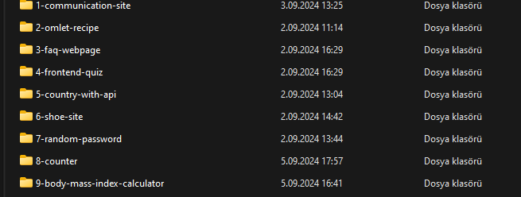

## Internship Projects
This repository contains multiple projects related to frontend development:

[1. Communication-site](https://github.com/alperendnc/internship-projects/tree/main/1-communication-site)

[2. Omlet-Recipe](https://github.com/alperendnc/internship-projects/tree/main/2-omlet-recipe)

[3. FAQ-Webpage](https://github.com/alperendnc/internship-projects/tree/main/3-faq-webpage
)

[4. Frontend-Quız](https://github.com/alperendnc/internship-projects/tree/main/4-frontend-quiz
)

[5. Country-With-Api](https://github.com/alperendnc/internship-projects/tree/main/5-country-with-api
)

[6. Shoe-Site](https://github.com/alperendnc/internship-projects/tree/main/6-shoe-site
)

[7. Random-Password](https://github.com/alperendnc/internship-projects/tree/main/7-random-password)
## Overview
The projects listed above have been completed during the internship and are simple projects that those looking to improve their skills in HTML, CSS, and JavaScript can undertake.

## Usage

To run this project on your local machine, follow these steps:

1. Clone the repository:
    ```bash
    git clone https://github.com/alperendnc/internship-projects.git
    ```
2.  Navigate to the project directory:
    ``` bash
    cd intership-projects
    ```
3.  Choose one of the projects 

    
    
4.  Open the `index.html` file in a web browser to view the recipe.


